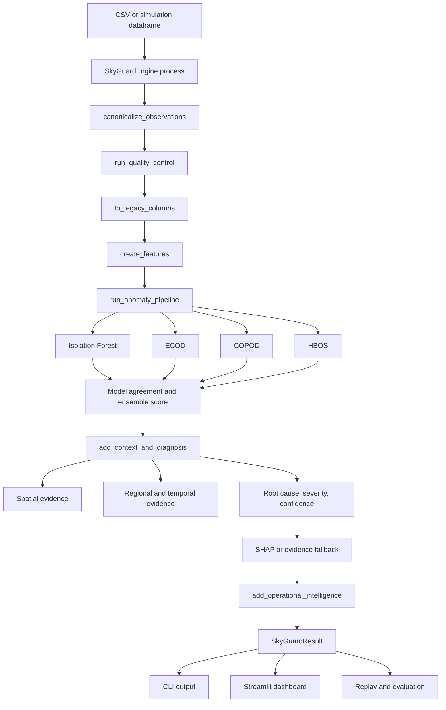
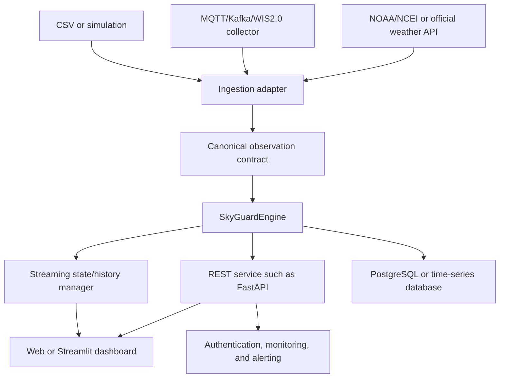

# SkyGuard AI

## Intelligent Quality Control, Anomaly Detection and Health Monitoring for Automated Weather Stations

**SIH 2026 Mentoring Round**  
**Documentation date:** 2026-09-05  
**Project status:** 🟢 IMPLEMENTED local MVP / 🔵 PROTOTYPE operational console  
**Current maturity:** A runnable local batch prototype with a canonical programmatic engine, deterministic QC, ensemble anomaly detection, contextual diagnosis, operational recommendations, evaluation, replay, and a Streamlit dashboard.

> This document is based on the repository currently present in the workspace. It distinguishes implemented behavior from planned and future architecture. The actual code and executable validation take priority over older planning documents.

---

## 1. Executive Summary

SkyGuard AI is a quality-control and anomaly-detection system for Automatic Weather Station observations. It helps an operator decide whether an unusual reading is probably trustworthy, a sensor/data problem, or evidence of a wider weather event.

The current MVP works with canonical observations containing:

- `station_id`
- `timestamp`
- `temperature`
- `pressure`
- `humidity`
- optional `latitude`, `longitude`, and `elevation`

The system combines several forms of evidence:

1. deterministic schema and physical QC;
2. leakage-safe temporal and derived features;
3. four unsupervised anomaly detectors;
4. temporal and station-neighbor context;
5. rule-based diagnosis, severity, and confidence;
6. optional SHAP feature attribution;
7. sensor health, maintenance, and recovery information.

The canonical application boundary is:

```python
from src.skyguard.engine import SkyGuardEngine

engine = SkyGuardEngine()
result = engine.process(dataframe)
```

The result contains a summary plus full row-level observations, anomalies, latest station health, diagnostics, metrics, and timings. CSV, simulation, replay, and dashboard workflows use the same underlying processing pipeline. No live API, REST service, database, authentication, or cloud deployment is implemented yet.

### Current verified baseline

- Real input processed: **9,360 observations**
- Real-input anomaly count: **155**
- Automated tests: **28 passed**
- Dashboard startup smoke test: HTTP **200**
- Latest reproducible evaluation:
  - precision: **0.400**
  - recall: **0.643**
  - F1: **0.493**
  - false-positive rate: **0.205**
  - weather-event recall: **0.500**

An older project report records precision `0.714`, recall `0.500`, F1 `0.560`, false-positive rate `0.061`, and weather-event recall `0.333`. Those values are retained as historical documentation, not presented as the current verified evaluation. The refactor did not change model thresholds or evaluation logic.

---

## 2. Problem Statement

### 2.1 Automated Weather Stations

An Automatic Weather Station records environmental observations at a station and time. SkyGuard currently processes temperature, relative humidity, and atmospheric pressure. The simulator also produces station coordinates, which enable neighbor comparisons.

These observations feed monitoring, weather analysis, forecasting workflows, and maintenance decisions. A faulty observation can contaminate downstream analysis even when it looks numerically plausible in isolation.

### 2.2 Data quality problems

The implemented QC layer handles or flags:

- sudden spikes and excessive rate changes;
- sustained drift/bias;
- frozen or stuck values;
- missing sensor values;
- timestamp gaps;
- duplicate station/timestamp records;
- values outside configured physical ranges;
- thermodynamic inconsistency between temperature, humidity, and derived dew point.

### 2.3 Why one threshold is insufficient

A rule such as `temperature > threshold` cannot distinguish a sensor fault from a genuine regional event. A single station may report an isolated jump while nearby stations remain stable, or several stations may change together because the weather changed.

SkyGuard therefore combines:

- recent station history;
- previous-observation differences and rolling baselines;
- relationships among temperature, pressure, and humidity;
- model agreement across four detectors;
- same-time nearby-station evidence when coordinates exist;
- regional timestamp-level temperature shifts;
- deterministic QC evidence.

The result is a richer operational answer than “value above threshold.”

---

## 3. Solution and Actual Pipeline

```text
Data source
    ↓
Ingestion and column normalization
    ↓
Canonical observation schema
    ↓
Deterministic QC
    ↓
Legacy internal representation
    ↓
Leakage-safe feature engineering
    ↓
Isolation Forest + ECOD + COPOD + HBOS
    ↓
Model agreement and ensemble score
    ↓
Temporal and spatial context
    ↓
Regional-event / sensor-fault classification
    ↓
Root-cause, severity, and confidence
    ↓
SHAP attribution or evidence fallback
    ↓
Sensor health, maintenance, and recovery
    ↓
SkyGuardResult and Streamlit dashboard
```

### Stage map

| Stage | Actual implementation | Input | Output | Type | Status |
| --- | --- | --- | --- | --- | --- |
| Ingestion | `src/skyguard/ingestion/csv_loader.py` | CSV/dataframe | normalized dataframe | adapter/normalization | 🟢 IMPLEMENTED |
| Schema | `src/skyguard/ingestion/schema.py` | row dictionaries/dataframes | canonical fields and dataclasses | contract/validation | 🟢 IMPLEMENTED |
| QC | `src/skyguard/preprocessing/quality_control.py` | canonical dataframe | QC flags and `QCResult` records | deterministic rules | 🟢 IMPLEMENTED |
| Features | `src/skyguard/features/engineering.py` | legacy-shaped checked dataframe | model-ready features | statistical/temporal | 🟢 IMPLEMENTED |
| Detection | `src/skyguard/detection/ensemble.py` | 13 model features | four model outputs and ensemble | unsupervised ML | 🟢 IMPLEMENTED |
| Context | `src/skyguard/context/spatial.py`, `src/skyguard/diagnosis/diagnostics.py` | scored rows and same-time stations | neighbor, regional, persistence evidence | statistical/rule-based | 🟢 IMPLEMENTED |
| Diagnosis | `src/skyguard/diagnosis/diagnostics.py` | all evidence | event type, root cause, severity, confidence | rule-based evidence fusion | 🟢 IMPLEMENTED |
| Explainability | `src/skyguard/explainability/explanations.py` | Isolation Forest and feature values | top SHAP feature or fallback | optional explainability | 🟡 PARTIALLY IMPLEMENTED |
| Health | `src/skyguard/health/operations.py` | anomaly/QC history | health score, trend, status | cumulative operational rules | 🟢 IMPLEMENTED |
| Recovery | `src/skyguard/health/operations.py` | temperature history | suggestion and original value | interpolation/review metadata | 🟢 IMPLEMENTED |
| Engine | `src/skyguard/engine.py` | canonical or legacy dataframe | `SkyGuardResult` | application boundary | 🟢 IMPLEMENTED |
| UI | `dashboard/app.py` | engine outputs and stored results | monitoring console | Streamlit/Plotly | 🟢 IMPLEMENTED prototype |

---

## 4. Current Architecture



### Future architecture

The following is future architecture, not current implementation:



No live collector, FastAPI service, streaming state manager, database, authentication, or cloud deployment exists in the current repository.

---

## 5. Codebase Map

The important current tree is:

```text
SkyGaurd-AI/
├── README.md
├── IMPLEMENTATION_STATUS.md
├── IMPLEMENTATION_REPORT.md
├── IMPLEMENTATION_ROADMAP.md
├── IMPLEMENTATION_ANALYSIS.md
├── DOCUMENTATION_COMPARISON.md
├── main.py
├── requirements.txt
├── pyproject.toml
├── .env.example
├── .gitignore
├── configs/
│   ├── config.yaml
│   ├── features.yaml
│   └── models.yaml
├── data/
│   ├── raw/README.md
│   ├── interim/
│   ├── processed/
│   │   ├── SkyGuard_clean_3hourly.csv
│   │   └── SkyGuard_features.csv
│   └── evaluation/
├── models/
│   ├── trained/
│   │   ├── baseline_model.pkl
│   │   ├── scaler.pkl
│   │   ├── isolation_forest.pkl
│   │   ├── ecod.pkl
│   │   ├── copod.pkl
│   │   └── hbos.pkl
│   └── metadata/README.md
├── outputs/
│   ├── exports/
│   │   ├── anomaly_detection_results.csv
│   │   ├── mvp_results.csv
│   │   └── simulated_results.csv
│   ├── evaluation/latest.csv
│   └── reports/
├── src/
│   ├── __init__.py
│   └── skyguard/
│       ├── __init__.py
│       ├── engine.py
│       ├── pipeline.py
│       ├── config.py
│       ├── ingestion/
│       ├── preprocessing/
│       ├── features/
│       ├── detection/
│       ├── context/
│       ├── diagnosis/
│       ├── explainability/
│       ├── health/
│       ├── evaluation/
│       ├── replay/
│       └── utils/
├── dashboard/
│   ├── app.py
│   ├── assets/README.md
│   ├── pages/
│   └── components/
├── scripts/
│   ├── run_pipeline.py
│   ├── run_evaluation.py
│   ├── train_models.py
│   └── generate_simulation.py
├── tests/
│   ├── unit/
│   └── integration/
├── docs/
│   ├── architecture.md
│   ├── data_pipeline.md
│   ├── anomaly_detection.md
│   ├── evaluation.md
│   ├── development.md
│   └── SIH_MENTORING_ROUND.md
└── archive/legacy/
    ├── dashboard_wrapper.py
    └── data_preprocessing.py
```

`dashboard/pages/` and `dashboard/components/` currently exist as preparation directories but contain no implemented page/component modules. The dashboard is currently monolithic in `dashboard/app.py`.

---

## 6. Folder-by-Folder Explanation

| Folder | Purpose | Contains | Used by / feeds into | Status |
| --- | --- | --- | --- | --- |
| `src/` | Python source root | package marker and `skyguard` package | CLI, dashboard, tests | 🟢 IMPLEMENTED |
| `src/skyguard/` | Core application package | engine, pipeline, configuration, domain subpackages | all application entry points | 🟢 IMPLEMENTED |
| `src/skyguard/ingestion/` | Canonical input boundary | `csv_loader.py`, `schema.py` | engine and pipeline | 🟢 IMPLEMENTED |
| `src/skyguard/preprocessing/` | Deterministic data-quality stage | `quality_control.py` | pipeline | 🟢 IMPLEMENTED |
| `src/skyguard/features/` | ML feature construction | `engineering.py` | pipeline and baseline service | 🟢 IMPLEMENTED |
| `src/skyguard/detection/` | Anomaly models and baseline service | `ensemble.py`, `baseline.py` | pipeline and CLI | 🟢 IMPLEMENTED |
| `src/skyguard/context/` | Contextual model boundary | `spatial.py`, `temporal.py` | diagnosis, CLI, dashboard | 🟡 PARTIALLY IMPLEMENTED |
| `src/skyguard/diagnosis/` | Context fusion and diagnosis | `diagnostics.py` | pipeline | 🟢 IMPLEMENTED |
| `src/skyguard/explainability/` | SHAP and fallback explanations | `explanations.py` | detection and dashboard | 🟡 PARTIALLY IMPLEMENTED |
| `src/skyguard/health/` | Health and operational output | `operations.py` | pipeline and dashboard | 🟢 IMPLEMENTED prototype |
| `src/skyguard/evaluation/` | Ground-truth scenarios and metrics | `scenarios.py`, `metrics.py`, `runner.py` | CLI, dashboard, tests | 🟢 IMPLEMENTED |
| `src/skyguard/replay/` | Row-by-row replay | `engine.py` | dashboard and tests | 🟢 IMPLEMENTED |
| `src/skyguard/utils/` | Shared path/logging helpers | `paths.py`, `logging.py` | engine and persistence | 🟢 IMPLEMENTED |
| `data/` | Dataset storage separated by purpose | raw, interim, processed, evaluation | loaders, scripts, evaluation | 🟢 IMPLEMENTED structure |
| `models/` | Persisted artifacts | trained models and metadata location | detection/baseline code | 🟢 IMPLEMENTED |
| `outputs/` | Generated results | exports, evaluation, reports | CLI, dashboard, evaluation | 🟢 IMPLEMENTED |
| `dashboard/` | Streamlit UI | one app plus empty extension dirs | operators and mentors | 🟢 IMPLEMENTED prototype |
| `tests/` | Automated verification | unit and integration tests | CI/developer workflow | 🟢 IMPLEMENTED |
| `scripts/` | Thin developer commands | pipeline, evaluation, training, simulation wrappers | developers | 🟢 IMPLEMENTED |
| `configs/` | Human-readable configuration reference | YAML files | documentation and future config loading | 🟡 PARTIALLY IMPLEMENTED |
| `docs/` | Technical/product documentation | architecture, data, development, evaluation, this guide | mentors and developers | 🟢 IMPLEMENTED |
| `archive/legacy/` | Preserved superseded files | old wrapper and preprocessing module | not imported by runtime | 🟢 ARCHIVE |

---

## 7. File-by-File Implementation Map

### Entry points and engine

| File | Classification | Responsibility | Important functions/classes | Called by / calls |
| --- | --- | --- | --- | --- |
| `main.py` | ENTRY POINT | Thin CLI orchestration for loading data, invoking the engine, saving output, and optional commands | `main` | user; calls `SkyGuardEngine`, baseline, evaluation, temporal status |
| `src/skyguard/engine.py` | ENGINE/API | Canonical programmatic boundary and result contract | `SkyGuardEngine`, `SkyGuardResult`, `process` | CLI and dashboard; calls canonicalization and `run_pipeline` |
| `src/skyguard/pipeline.py` | PIPELINE ORCHESTRATION | Existing dataframe pipeline and compatibility helpers | `run_pipeline`, `run_csv`, `process_batch`, `process_observation`, `_structured_result`, `_build_qc_only_results` | engine, replay, evaluation, tests; calls every core stage |
| `src/skyguard/config.py` | CONFIGURATION | Dataclass configuration for thresholds, model settings, paths, and feature flags | `QCConfig`, `IsolationForestConfig`, `PathConfig`, `AppConfig`, `DEFAULT_CONFIG` | pipeline, detection, CLI, dashboard |
| `src/skyguard/utils/paths.py` | UTILITY | Resolves relative paths from repository root | `resolve_project_path`, `PROJECT_ROOT` | artifact readers/writers |
| `src/skyguard/utils/logging.py` | UTILITY | Returns shared logger | `get_logger` | engine and pipeline |

### Ingestion and schema

| File | Classification | Responsibility | Important functions/classes | Output |
| --- | --- | --- | --- | --- |
| `src/skyguard/ingestion/csv_loader.py` | DATA INGESTION | Normalizes legacy and canonical columns, loads multiple CSVs, creates simulations | `canonicalize_observations`, `load_observations`, `to_legacy_columns`, `simulate_observations` | canonical dataframe or legacy internal dataframe |
| `src/skyguard/ingestion/schema.py` | DATA CONTRACT | Defines enums/dataclasses and row validation | `RawObservation`, `QCResult`, `ProcessedObservation`, `validate_observation`, `validate_observation_dataframe` | structured contracts and schema errors |

Canonical required columns are `station_id`, `timestamp`, `temperature`, `pressure`, and `humidity`. Legacy aliases such as `Location`, `DateTime`, `Temperature_C`, `Pressure_hPa`, and `Humidity_Percent` are normalized by `canonicalize_observations`.

### Preprocessing and features

| File | Classification | Responsibility | Important functions | Outputs |
| --- | --- | --- | --- | --- |
| `src/skyguard/preprocessing/quality_control.py` | QUALITY CONTROL | Computes deterministic flags and structured rule results | `run_quality_control`, `_build_rule_results`, `_dew_point` | `_fail` flags, `qc_failed`, `qc_flags`, `dew_point`, `thermodynamic_fail`, `qc_results` |
| `src/skyguard/features/engineering.py` | FEATURE ENGINEERING | Computes previous-observation differences, rolling baselines, deviations, and local z-scores | `create_features` | 13 model features plus supporting columns |
| `archive/legacy/data_preprocessing.py` | LEGACY | Superseded preprocessing implementation retained for traceability | none used by active runtime | no current pipeline output |

### Detection and context

| File | Classification | Responsibility | Important functions/classes | Outputs |
| --- | --- | --- | --- | --- |
| `src/skyguard/detection/ensemble.py` | ML MODEL | Fits/scorers four detectors, normalizes scores, combines agreement, persists artifacts | `run_anomaly_pipeline`, `normalize_scores`, `MODEL_FEATURES` | per-model flags/scores, `Model_Agreement`, `Ensemble_Score`, `Ensemble_Anomaly`, severity label |
| `src/skyguard/detection/baseline.py` | ML MODEL / SERVICE | Trains, persists, loads, and scores the separate clean baseline model | `BaselineModel`, `train_baseline`, `load_baseline`, `score_with_baseline`, `prepare_training_features` | persisted `baseline_model.pkl`, baseline scores |
| `src/skyguard/context/spatial.py` | CONTEXTUAL ANALYSIS | Finds up to three same-time nearest coordinate-aware neighbors and compares temperature | `evaluate_spatial_context`, `_distance_km` | median, deviation, MAD, consensus, neighbor IDs |
| `src/skyguard/context/temporal.py` | OPTIONAL MODEL / CONTEXT | Reports optional TensorFlow LSTM status and supports sequence training/scoring | `temporal_model_status`, `make_sequences`, `train_lstm_autoencoder`, `score_lstm_autoencoder` | explicit optional status or LSTM artifacts |
| `src/skyguard/diagnosis/diagnostics.py` | DIAGNOSIS | Combines anomaly, spatial, regional, temporal, and QC evidence | `add_context_and_diagnosis`, `_explanation` | event type, root cause, severity, confidence, explanation |

### Explainability and operations

| File | Classification | Responsibility | Important functions | Outputs |
| --- | --- | --- | --- | --- |
| `src/skyguard/explainability/explanations.py` | EXPLAINABILITY | Computes optional Isolation Forest SHAP top feature or honest fallback | `explain_observation`, `explain_batch` | SHAP availability, top feature, contribution, note |
| `src/skyguard/health/operations.py` | SENSOR HEALTH / OPERATIONS | Calculates cumulative station health, trend, status, recommendations, and recovery suggestion | `add_operational_intelligence` | `health_score`, `health_trend`, `health_status`, maintenance/recovery fields |
| `src/skyguard/replay/engine.py` | REPLAY | Reprocesses increasing historical prefixes and measures latency | `ReplayRecord`, `replay` | row position, timestamp, latency, latest result dictionary |

### Evaluation and UI

| File | Classification | Responsibility | Important functions/classes |
| --- | --- | --- | --- |
| `src/skyguard/evaluation/scenarios.py` | EVALUATION | Injects reproducible spike, frozen, drift, communication, isolated-fault, and regional-event scenarios | `inject_anomaly`, `inject_isolated_fault`, `inject_regional_event` |
| `src/skyguard/evaluation/metrics.py` | EVALUATION | Computes detection, per-label, event, confusion, and latency metrics | `evaluate_detection` |
| `src/skyguard/evaluation/runner.py` | EVALUATION | Builds the five-scenario evaluation and persists its row report | `run_evaluation` |
| `dashboard/app.py` | DASHBOARD/UI | Monolithic Streamlit console with navigation sections and Plotly charts | `main`, `analyze`, `dashboard_page`, `station_page`, `anomalies_page`, `investigation_view`, `health_page`, `evaluation_page`, `replay_page` |
| `scripts/*.py` | ENTRY POINTS | Thin wrappers around existing application APIs | `run_pipeline`, `run_evaluation`, `train_models`, `generate_simulation` |

---

## 8. Exactly Where Is the ML?

The active ML implementation is concentrated in **one file**, not split into one file per model.

### Isolation Forest

- **File:** `src/skyguard/detection/ensemble.py`
- **Library:** `sklearn.ensemble.IsolationForest`
- **Function:** `run_anomaly_pipeline`
- **Training:** creates `StandardScaler`, scales the selected feature matrix, constructs `IsolationForest(n_estimators=300, contamination=contamination, random_state=42, n_jobs=-1)`, and calls `fit`.
- **Scoring:** `predict` produces `IF_Anomaly`; negative decision function is inverted into `IF_Score_Raw` and normalized to `IF_Score`.
- **Input:** the 13 `MODEL_FEATURES` listed below.
- **Output:** flag, raw score, normalized score, and SHAP attribution for this tree model.

### ECOD

- **File:** `src/skyguard/detection/ensemble.py`
- **Library:** `pyod.models.ecod.ECOD`
- **Function:** `run_anomaly_pipeline`
- **Training/scoring:** `fit(X_scaled)`, then `labels_` becomes `ECOD_Anomaly` and `decision_scores_` becomes normalized `ECOD_Score`.

### COPOD

- **File:** `src/skyguard/detection/ensemble.py`
- **Library:** `pyod.models.copod.COPOD`
- **Function:** `run_anomaly_pipeline`
- **Training/scoring:** `fit(X_scaled)`, then `labels_` becomes `COPOD_Anomaly` and `decision_scores_` becomes normalized `COPOD_Score`.

### HBOS

- **File:** `src/skyguard/detection/ensemble.py`
- **Library:** `pyod.models.hbos.HBOS`
- **Function:** `run_anomaly_pipeline`
- **Training/scoring:** `fit(X_scaled)`, then `labels_` becomes `HBOS_Anomaly` and `decision_scores_` becomes normalized `HBOS_Score`.

### Ensemble rule

The four binary outputs are added:

```text
Model_Agreement = IF_Anomaly + ECOD_Anomaly + COPOD_Anomaly + HBOS_Anomaly
```

The normalized scores are averaged:

```text
Ensemble_Score = (IF_Score + ECOD_Score + COPOD_Score + HBOS_Score) / 4
```

The candidate ensemble anomaly decision is:

```text
Ensemble_Anomaly = 1 when Model_Agreement >= 3, otherwise 0
```

The later pipeline adds deterministic rule evidence into `Rule_Anomaly` and produces:

```text
Final_Anomaly = Ensemble_Anomaly OR Rule_Anomaly
Final_Score = max(Ensemble_Score, Rule_Anomaly)
```

This is unsupervised batch detection. The active ensemble is fit on each processed batch. The separate clean-baseline service in `detection/baseline.py` provides persisted training and inference, but it does not replace the existing ensemble path.

### Actual model feature list

`MODEL_FEATURES` contains 13 fields:

1. `Temperature_C`
2. `Humidity_Percent`
3. `Pressure_hPa`
4. `Temperature_Diff`
5. `Humidity_Diff`
6. `Pressure_Diff`
7. `Temperature_Deviation`
8. `Humidity_Deviation`
9. `Pressure_Deviation`
10. `Temperature_LocalZ`
11. `Humidity_LocalZ`
12. `Pressure_LocalZ`
13. `Pressure_Missing`

---

## 9. Exactly Where Is Data Cleaning and QC?

### Schema normalization

```text
Input dataframe
    ↓
canonicalize_observations
    ↓
src/skyguard/ingestion/csv_loader.py
    ↓
canonical station_id/timestamp/temperature/pressure/humidity dataframe
```

`canonicalize_observations` renames legacy columns, verifies required columns, converts timestamps with `pd.to_datetime`, converts sensor values numerically, strips station IDs, and sorts by timestamp/station.

### QC operations

| Operation | File | Function | Input | Output |
| --- | --- | --- | --- | --- |
| Missingness | `preprocessing/quality_control.py` | `run_quality_control` | canonical dataframe | `missing_fail` |
| Timestamp gaps | same | `run_quality_control` | station timestamp differences | `timestamp_gap_fail` |
| Duplicates | same | `run_quality_control` | station/timestamp keys | `duplicate_fail` |
| Physical ranges | same | `run_quality_control` | sensor values and `DEFAULT_CONFIG.qc` | variable `_range_fail` flags |
| Rate changes | same | `run_quality_control` | previous station value and elapsed hours | variable `_rate_fail` flags |
| Baseline deviation | same | `run_quality_control` | previous four-observation rolling median | variable `_deviation_fail` flags |
| Frozen/persistence | same | `run_quality_control` | rolling standard deviation | variable `_persistence_fail` and `persistence_fail` |
| Drift | same | `run_quality_control` | sustained directional differences | variable `_drift_fail` flags |
| Dew point | same | `_dew_point` | temperature and humidity | `dew_point` |
| Thermodynamic check | same | `run_quality_control` | dew point versus temperature | `thermodynamic_fail` |
| Structured QC | same | `_build_rule_results` | all flags | list of `QCResult` dataclasses |

Configured ranges and thresholds are in `src/skyguard/config.py`:

- temperature: `-50` to `60` °C, maximum step `12` per hour;
- pressure: `850` to `1100` hPa, maximum step `8` per hour;
- humidity: `0` to `100` %, maximum step `35` per hour;
- persistence window: `4` observations;
- baseline deviation: `10`;
- drift window: `4`, drift threshold `5`;
- expected interval: `3` hours;
- dew-point tolerance: `0.25`.

The pipeline preserves QC-only rows removed by the feature warm-up stage through `_build_qc_only_results`. Missing values are flagged and recovery suggestions are stored separately; original values are not overwritten.

---

## 10. Exactly Where Is Feature Engineering?

`src/skyguard/features/engineering.py:create_features` sorts by station and time and uses grouped station history.

### Raw values

- `Temperature_C`
- `Humidity_Percent`
- `Pressure_hPa`
- `Pressure_Missing`

### Difference features

- `Temperature_Diff`
- `Humidity_Diff`
- `Pressure_Diff`

These are current minus previous station observation.

### Previous-history rolling features

The function calculates four-observation shifted rolling means and standard deviations for each variable. The `shift(1)` is important: the current observation cannot influence its own baseline.

### Derived deviation and z-score features

- `Temperature_Deviation`
- `Humidity_Deviation`
- `Pressure_Deviation`
- `Temperature_LocalZ`
- `Humidity_LocalZ`
- `Pressure_LocalZ`

Rolling means and standard deviations are internal helpers and are removed before model scoring. The first observations without sufficient history are dropped from model scoring, but QC-only rows are later restored by the pipeline. This is the current warm-up behavior.

### Leakage prevention

The feature code uses previous observations through `shift(1)` before rolling calculations. Current values are not used to construct their own baseline. The model does not use `Location` as a feature.

---

## 11. One Observation Through the Code

A canonical row follows this path:

```text
CSV row
  ↓
pd.read_csv in main.py or dashboard upload
  ↓
SkyGuardEngine.process
  ↓
canonicalize_observations
  ↓
run_quality_control
  ↓
to_legacy_columns
  ↓
create_features
  ↓
13 MODEL_FEATURES
  ↓
StandardScaler.fit_transform
  ↓
IsolationForest.fit/predict/decision_function
  ↓
ECOD.fit and labels_/decision_scores_
  ↓
COPOD.fit and labels_/decision_scores_
  ↓
HBOS.fit and labels_/decision_scores_
  ↓
Model_Agreement, Ensemble_Score, Ensemble_Anomaly
  ↓
run_pipeline rule combination
  ↓
add_context_and_diagnosis
  ↓
evaluate_spatial_context and regional/temporal rules
  ↓
event_type, root_cause, severity, confidence, explanation
  ↓
explain_batch SHAP attribution for Isolation Forest or fallback
  ↓
add_operational_intelligence
  ↓
health score/status, maintenance, recovery metadata
  ↓
SkyGuardResult.observations / anomalies
  ↓
CLI CSV, replay, evaluation, or dashboard
```

The raw value remains in the row. `recovery_suggestion` and `recovery_original_temperature` are separate fields; no source measurement is silently replaced.

---

## 12. Complete Execution Flow

### CLI

```text
python main.py --input data/processed/SkyGuard_clean_3hourly.csv
    ↓
main.py: main
    ↓
pd.read_csv
    ↓
SkyGuardEngine().process(df)
    ↓
canonicalize_observations
    ↓
run_pipeline
    ↓
QC → features → four-model ensemble → diagnosis → operations
    ↓
SkyGuardResult.observations
    ↓
CSV written to outputs/exports/anomaly_detection_results.csv
```

Other implemented commands:

```powershell
python main.py --simulate
python main.py --train-baseline
python main.py --score-baseline
python main.py --evaluate
python main.py --lstm-status
python main.py --train-lstm
```

### Dashboard execution flow

```text
streamlit run dashboard/app.py
    ↓
dashboard/app.py: main
    ↓
load bundled results or upload CSV
    ↓
analyze → SkyGuardEngine.process → result.observations
    ↓
selected navigation section
    ↓
KPIs, anomaly queue, station trends, health, evaluation, replay, or data preview
```

The dashboard contains presentation and interaction logic. It does not implement a second QC or ML pipeline.

---

## 13. Technology Stack

| Technology | Why used | Actual locations |
| --- | --- | --- |
| Python | Application and scientific-computing ecosystem | all runtime files |
| pandas | Dataframes, grouping, rolling calculations, CSV I/O, metrics | ingestion, features, pipeline, dashboard, tests |
| NumPy | Numeric operations, simulation, dew point, distances | simulation, QC, detection, spatial |
| scikit-learn | `StandardScaler`, `IsolationForest` | detection and baseline |
| PyOD | ECOD, COPOD, HBOS implementations | `detection/ensemble.py` |
| joblib | Model artifact persistence | ensemble and baseline |
| SHAP | Optional Isolation Forest feature attribution | `explainability/explanations.py` |
| TensorFlow | Optional LSTM autoencoder only | `context/temporal.py`, not installed in current environment |
| Streamlit | Local operator dashboard | `dashboard/app.py` |
| Plotly | Interactive trend and evidence charts | `dashboard/app.py` |
| pytest | Unit and integration tests | `tests/` |
| pathlib | Project-relative path handling | configuration and utilities |

No FastAPI, MQTT, Kafka, database, Docker, cloud SDK, or REST framework is used by the current implementation.

---

## 14. Data and Model Artifacts

### Data locations

- `data/processed/SkyGuard_clean_3hourly.csv`: current real processed input used by the baseline CLI run.
- `data/processed/SkyGuard_features.csv`: feature dataset location referenced by configuration.
- `data/raw/`: reserved for original uploaded/downloaded files; no active live collector exists.
- `data/interim/`: reserved for intermediate transformations.
- `data/evaluation/`: reserved for evaluation datasets and generated simulation inputs.
- `outputs/exports/`: generated pipeline CSV exports.
- `outputs/evaluation/latest.csv`: current reproducible evaluation report.

### Simulation and injection

`simulate_observations` creates deterministic multi-station observations with coordinates using NumPy and a fixed seed by default. `inject_anomaly` supports:

- `SPIKE`: adds a large variable-specific offset;
- `FROZEN_STUCK`: repeats the first selected value;
- `DRIFT_BIAS`: adds a growing bias;
- `COMMUNICATION_MISSING`: sets the selected variable to missing.

`inject_regional_event` applies the same temperature shift to all stations at selected timestamps and labels the rows `WEATHER_EVENT`.

### Training, inference, and evaluation

**Current ensemble path:** `run_anomaly_pipeline` fits the scaler and all four detectors on the supplied batch, scores that batch, persists component artifacts, and returns row-level outputs. This is the behavior preserved by the current MVP.

**Persisted baseline path:** `train_baseline` in `detection/baseline.py` prepares features, excludes non-`NORMAL` ground-truth rows when labels exist, fits a scaler and Isolation Forest, and writes `models/trained/baseline_model.pkl`. `load_baseline` and `score_with_baseline` support later inference.

**Evaluation path:** `evaluation/runner.py` creates clean simulated data, injects four isolated fault scenarios plus one regional event, runs the normal pipeline, computes metrics, and writes `outputs/evaluation/latest.csv`.

Artifacts currently stored under `models/trained/` include the baseline, scaler, Isolation Forest, ECOD, COPOD, and HBOS files. Model metadata is reserved under `models/metadata/` but no richer metadata registry is implemented.

---

## 15. Contextual Intelligence

### Temporal context

Current temporal evidence is rule/statistical rather than a production sequence model:

- previous differences and shifted rolling baselines come from `features/engineering.py`;
- persistence is calculated in QC;
- `temporal_persistence` is a three-row rolling anomaly count in `diagnostics.py`.

The LSTM autoencoder functions exist as an optional boundary in `context/temporal.py`. TensorFlow is unavailable in the current environment, so LSTM training/scoring is not active.

### Spatial context

`evaluate_spatial_context` checks whether target coordinates and same-time candidate rows contain latitude, longitude, and temperature. It calculates haversine distance, selects up to three closest stations, and returns neighbor median, absolute deviation, MAD, IDs, and consensus.

### Regional event detection

`add_context_and_diagnosis` calculates the timestamp-level median temperature, its absolute shift, and compares that shift with `regional_shift_threshold` (`3.0`). It marks `regional_event_signal` and can promote `Final_Anomaly`.

### Isolated fault detection

An anomalous station with spatial deviation at least `8` is classified as `SENSOR_FAULT`. A lower-deviation anomaly with sufficient neighbor consensus or regional signal is classified as `WEATHER_EVENT`. Otherwise the result becomes `UNCERTAIN`.

These are statistical and rule-based contextual methods, not additional ML models.

---

## 16. Root-Cause Diagnosis

`src/skyguard/diagnosis/diagnostics.py:add_context_and_diagnosis` assigns categories in this order:

| Root cause | Evidence used | Output logic |
| --- | --- | --- |
| `COMMUNICATION_MISSING` | missing sensor values | assigned when `missing_fail` is true |
| `FROZEN_STUCK` | persistence flags | assigned when `persistence_fail` and not missing |
| `DRIFT_BIAS` | drift flags | assigned when any variable drift flag is true and no previous cause exists |
| `SPIKE` | deviation, rate, or temperature range flags | assigned when those flags are true and no previous cause exists |
| `UNKNOWN` | model anomaly without another rule cause | assigned for remaining anomaly rows |
| `NONE` | no assigned fault | normal/default state |

The output is not a learned root-cause classifier. It is deterministic evidence fusion over QC, model, temporal, and spatial fields.

---

## 17. Severity and Confidence

Severity is calculated in `diagnostics.py` from `Final_Score` using `pd.cut`:

```text
(-0.01, 0.50]  -> LOW
(0.50, 0.70]   -> MEDIUM
(0.70, 0.85]   -> HIGH
(0.85, 1.01]   -> CRITICAL
```

Rows with no anomaly in the selected anomaly column are explicitly set to `LOW`.

Confidence is calculated as:

```text
confidence = 0.45
           + 0.15 * Model_Agreement
           + 0.10 * (neighbor_consensus >= 0.5)
```

The result is clipped to `[0, 1]` and rounded to three decimals. This is evidence strength, not calibrated probability or guaranteed accuracy.

---

## 18. Explainability

`src/skyguard/explainability/explanations.py` uses SHAP only for the fitted Isolation Forest tree model.

- `explain_observation` can use `shap.TreeExplainer` when a model and feature values are supplied.
- `explain_batch` adds row-level top-feature fields to the ensemble output.
- The fallback returns `available=False`, method `evidence fallback`, and a note explaining that QC, temporal, spatial, and model evidence are being used.

SHAP is an explainability technique, not a separate anomaly-detection model. Its contribution values are not causal proof.

---

## 19. Sensor Health, Maintenance, and Recovery

`src/skyguard/health/operations.py:add_operational_intelligence` calculates:

```text
health_score = 100 - cumulative(anomaly_penalty + qc_penalty - recovery_credit)
```

- anomaly penalty: `12` per final anomaly;
- QC penalty: `4` per QC failure;
- recovery credit: `2` for a normal, QC-clean observation.

The score is grouped by station, cumulatively updated, and clipped to `[0, 100]`. Health status bands are:

- `0–40`: `CRITICAL`
- `40–70`: `DEGRADING`
- `70–90`: `WARNING`
- `90–100`: `HEALTHY`

The current implementation provides one overall station health signal, not independent temperature/humidity/pressure sensor health models. The dashboard displays available overall health values in its sensor-health view.

Maintenance recommendations are deterministic:

- communication/missing: inspect telemetry link and station power;
- frozen/stuck: inspect sensor for a stuck or obstructed probe;
- spike/unknown: review calibration and recent observations;
- otherwise: no action required.

Recovery uses station-wise temperature interpolation to create a suggestion, retains `recovery_original_temperature`, records method `temporal interpolation`, and marks missing-temperature rows `SUGGESTED`. It does not overwrite original observations.

---

## 20. Dashboard Code Map

There is one implemented Streamlit file, `dashboard/app.py`. The prepared `dashboard/pages/` and `dashboard/components/` directories are empty; they are not separate active modules.

| Dashboard section | File/function | Data consumed | User actions/output |
| --- | --- | --- | --- |
| Dashboard | `dashboard_page` | engine observations/bundled result dataframe | KPI cards, active anomaly queue, health pulse, station overview |
| Stations | `station_page` | selected station rows | 1h/6h/24h/7d trend selection and separate variable charts |
| Anomalies | `anomalies_page` | final anomaly rows | station/severity/cause/diagnosis filters, anomaly selection |
| Anomaly investigation | `investigation_view` | selected row | explanation, evidence, event classification, QC, SHAP, recommendation, recovery |
| Sensor Health | `health_page` | latest row per station | health progress indicators and recommendations |
| Evaluation | `evaluation_page` | stored report or `run_evaluation` | measured metric cards and evaluation trigger |
| Replay | `replay_page` | selected observations | replay count, row-by-row latency table, completion summary |
| Data source | `main` section | bundled/uploaded dataframe | CSV upload and data preview |
| Settings/About | `main` section | temporal status | project description and optional model status |

The file also contains reusable local helpers such as `metric_card`, `status_badge`, `issue_card`, `evidence_chart`, and numeric formatting. Plotly charts are created inline for trends, health history, evidence, and anomaly composition. There are no separate chart/table/card component files yet.

The dashboard reads bundled results from the centralized configured path and uses `SkyGuardEngine` for uploaded CSV analysis. It does not implement ML logic independently.

---

## 21. Test Code Map

| Test file | Coverage |
| --- | --- |
| `tests/unit/test_config.py` | configuration guardrails and structured paths |
| `tests/unit/test_schemas.py` | canonical observation validation and schema contracts |
| `tests/unit/test_quality_control.py` | deterministic QC behavior |
| `tests/unit/test_spatial.py` | coordinate-aware spatial context |
| `tests/unit/test_engine.py` | engine result contract, empty input, invalid schema, repeated-call isolation |
| `tests/integration/test_pipeline.py` | simulation, injection, pipeline output, evaluation, replay, structured helpers, regional event, missing fast path, SHAP fallback/availability, optional temporal status |

Current result:

```text
28 passed
```

The original 24-test suite remains passing; four direct engine tests were added for Step 2 stabilization.

---

## 22. Evaluation

The evaluation runner uses:

- deterministic simulation with four stations and 40 periods;
- four isolated fault scenarios: spike, frozen/stuck, drift/bias, communication/missing;
- one regional weather-event scenario;
- `ground_truth` labels;
- the same normal pipeline used by the application;
- precision, recall, F1, false-positive/negative rates, per-root-cause metrics, confusion matrices, weather-event recall, and latency.

The current command is:

```powershell
python main.py --evaluate
```

The latest verified run produced 160 evaluation rows and:

```text
precision:           0.400
recall:              0.643
F1:                  0.493
false-positive rate: 0.205
weather-event recall:0.500
```

These are measured results from controlled scenarios, not production guarantees. Synthetic ground truth is useful for reproducibility but does not replace broad field labels.

---

## 23. Current Implementation Matrix

| Feature | Status | Exact file(s) | Notes |
| --- | --- | --- | --- |
| CSV ingestion | 🟢 IMPLEMENTED | `ingestion/csv_loader.py` | canonical and legacy aliases |
| Schema normalization | 🟢 IMPLEMENTED | `ingestion/csv_loader.py`, `ingestion/schema.py` | required canonical fields |
| QC | 🟢 IMPLEMENTED | `preprocessing/quality_control.py` | range, rate, missing, gaps, duplicates, persistence, drift, dew point |
| Feature engineering | 🟢 IMPLEMENTED | `features/engineering.py` | shifted rolling features and local z-scores |
| Isolation Forest | 🟢 IMPLEMENTED | `detection/ensemble.py` | 300 estimators, seeded |
| ECOD | 🟢 IMPLEMENTED | `detection/ensemble.py` | PyOD |
| COPOD | 🟢 IMPLEMENTED | `detection/ensemble.py` | PyOD |
| HBOS | 🟢 IMPLEMENTED | `detection/ensemble.py` | PyOD |
| Ensemble | 🟢 IMPLEMENTED | `detection/ensemble.py`, `pipeline.py` | 3-of-4 agreement plus QC rule combination |
| Temporal context | 🟢 IMPLEMENTED / 🟠 optional LSTM | `features/engineering.py`, `diagnosis/diagnostics.py`, `context/temporal.py` | current active path is statistical/rule-based |
| Spatial context | 🟢 IMPLEMENTED | `context/spatial.py` | requires coordinates and same-time neighbors |
| Weather-event detection | 🟢 IMPLEMENTED prototype | `diagnosis/diagnostics.py` | regional shift and neighbor consensus |
| Root-cause diagnosis | 🟢 IMPLEMENTED | `diagnosis/diagnostics.py` | deterministic evidence order |
| Severity | 🟢 IMPLEMENTED | `diagnosis/diagnostics.py` | score bands |
| Confidence | 🟢 IMPLEMENTED | `diagnosis/diagnostics.py` | evidence formula, not calibrated probability |
| SHAP | 🟡 PARTIALLY IMPLEMENTED | `explainability/explanations.py` | Isolation Forest attribution with fallback |
| Sensor health | 🟢 IMPLEMENTED prototype | `health/operations.py` | cumulative overall station score |
| Maintenance | 🟢 IMPLEMENTED | `health/operations.py` | deterministic recommendations |
| Recovery | 🟢 IMPLEMENTED prototype | `health/operations.py` | interpolation suggestion, raw preserved |
| Canonical engine | 🟢 IMPLEMENTED | `engine.py` | `SkyGuardEngine.process` |
| Dashboard | 🟢 IMPLEMENTED prototype | `dashboard/app.py` | monolithic navigation sections |
| Evaluation | 🟢 IMPLEMENTED | `evaluation/*` | reproducible synthetic scenarios |
| Replay | 🟢 IMPLEMENTED prototype | `replay/engine.py` | batch-prefix replay and latency |
| LSTM autoencoder | 🟠 PLANNED / optional boundary | `context/temporal.py` | TensorFlow unavailable |
| Live API | ⚪ FUTURE | none | no collector exists |
| REST API | ⚪ FUTURE | none | no FastAPI service exists |
| Database | ⚪ FUTURE | none | file outputs only |
| Cloud deployment | ⚪ FUTURE | none | local prototype |
| Authentication | ⚪ FUTURE | none | not implemented |

---

## 24. Limitations

### ML limitations

- The active ensemble is unsupervised and fit on each batch.
- Synthetic injected labels do not represent complete field ground truth.
- Current evaluation shows meaningful false positives and only moderate recall.
- Regional events can be confused with anomalies when station coverage or consensus is limited.
- The confidence score is an evidence heuristic, not a calibrated probability.
- The persisted clean baseline is a separate service path and is not the default ensemble inference path.

### Data limitations

- Current real data is a local processed CSV.
- Station coverage depends on records containing coordinates and same-time neighbor rows.
- Missing values are flagged; recovery suggestions are not automatic corrections.
- The active model requires sufficient history for engineered features; warm-up behavior is explicit.

### Infrastructure limitations

- Local batch prototype only.
- No live weather API, REST API, database, authentication, cloud deployment, production monitoring, or alerting.
- No streaming state manager for single-observation production ingestion.

### Dashboard limitations

- One monolithic `dashboard/app.py`; page/component directories are prepared but empty.
- Replay is a functional batch-prefix view, not a full asynchronous pause/resume live simulator.
- No coordinate map is implemented.
- Evaluation UI is summary-oriented and does not render every confusion matrix/scenario chart.
- Sensor health is currently overall station health, not independent per-sensor health.
- Browser-level click-through verification was not performed in the development session because no browser page was shared; server startup and HTTP response were verified.

---

## 25. Future Scope

All items in this section are future unless marked otherwise.

### Phase 1 — Live data ⚪ FUTURE

Add NOAA/NCEI, official weather APIs, or institutional AWS feeds as ingestion adapters that output the canonical dataframe.

### Phase 2 — REST API ⚪ FUTURE

Expose `SkyGuardEngine.process` through a service such as FastAPI while keeping the core engine independent of HTTP.

### Phase 3 — Real-time ingestion ⚪ FUTURE

Add MQTT, Kafka, or WIS2.0 collectors and a history/state manager for incremental features.

### Phase 4 — Database ⚪ FUTURE

Persist observations, results, model versions, and audit data in PostgreSQL or a time-series database.

### Phase 5 — Advanced ML 🟠 PLANNED

Activate the optional LSTM autoencoder when TensorFlow is intentionally installed; consider sequence models, seasonal modeling, and adaptive baselines only after evaluation design is expanded.

### Phase 6 — Production ⚪ FUTURE

Add cloud deployment, authentication, alerting, monitoring, API governance, and operational SLOs.

### Phase 7 — Edge ⚪ FUTURE

Evaluate ESP32 or other edge inference only after model size, update, and telemetry constraints are defined.

---

## 26. How the MVP Becomes a Live System

```text
CURRENT
CSV or simulation
    ↓
canonicalize_observations
    ↓
SkyGuardEngine.process
    ↓
Streamlit / CSV output
```

```text
FUTURE
Live weather API or MQTT/Kafka collector
    ↓
ingestion adapter
    ↓
canonical observation contract
    ↓
state/history manager
    ↓
SkyGuardEngine
    ↓
REST API and dashboard
```

The core design decision is to keep source-specific collection outside `src/skyguard/engine.py` and `src/skyguard/pipeline.py`. A future adapter should produce the same canonical columns and should not require changes to the detection or diagnosis algorithms.

---

## 27. SIH Demonstration Flow

1. Open the Streamlit dashboard.
2. Show the default bundled results and station count.
3. Show the station overview and normal trends.
4. Use the anomaly queue to select a detected row.
5. Show observed value, model agreement, ensemble score, severity, and confidence.
6. Show QC flags and the plain-language explanation.
7. Show spatial evidence when coordinates are available.
8. Explain the `WEATHER_EVENT` versus `SENSOR_FAULT` classification.
9. Show SHAP top-feature attribution or the explicit fallback state.
10. Show station health and maintenance recommendation.
11. Show recovery metadata without claiming that raw data was changed.
12. Open Evaluation and run the reproducible scenario report.
13. Open Replay and show measured per-prefix latency.
14. Explain that current data is local batch/simulation and live API integration is future.

The dashboard demonstrates real stored or processed output. Controlled anomaly injection and evaluation are available through the evaluation runner and tests.

---

## 28. Likely SIH Mentor Questions and Answers

### What exact problem are you solving?

SkyGuard identifies questionable Automatic Weather Station observations and helps distinguish isolated sensor/data faults from coordinated regional weather behavior.

### Why are weather-station data errors important?

Faulty observations can contaminate monitoring, analysis, and downstream forecasting. Operators need evidence and an action path, not only a binary flag.

### Where exactly is the ML?

The ML is in `src/skyguard/detection/ensemble.py`: Isolation Forest from scikit-learn plus ECOD, COPOD, and HBOS from PyOD. Other layers are deterministic QC, statistical feature engineering, contextual analysis, or operations logic.

### Why unsupervised learning?

Complete labels for operational sensor failures are difficult to obtain. The current MVP uses unsupervised detectors plus controlled synthetic injection for reproducible evaluation. This is useful but not a substitute for field labels.

### Why four models?

The ensemble uses different anomaly-scoring approaches and requires at least three of four model flags to agree for its primary candidate anomaly. This reduces dependence on one detector, although it does not eliminate false positives.

### Why not LSTM?

An optional LSTM boundary exists, but TensorFlow is unavailable and the current MVP does not claim active LSTM scoring. It remains an optional future capability.

### How do you avoid leakage?

Feature rolling baselines use `shift(1)`, so the current observation does not influence its own baseline. Station identity is used for grouping, not as a model feature.

### How are missing values handled?

Canonicalization converts numeric values and QC flags missing values. The pipeline preserves QC-only rows that do not reach model scoring during feature warm-up. Recovery stores an interpolation suggestion separately from the original value.

### How do you detect frozen sensors?

`run_quality_control` calculates rolling standard deviation over the configured persistence window. A near-zero result sets persistence flags, which diagnosis maps to `FROZEN_STUCK` unless missingness has priority.

### How do you handle communication failure?

Missing required sensor values set `missing_fail`; diagnosis assigns `COMMUNICATION_MISSING`, and operations recommends inspecting telemetry and station power.

### How do you distinguish a weather event from a sensor fault?

Same-time coordinate-aware neighbors provide median/deviation/consensus evidence. Regional median temperature shifts also create a regional signal. Large isolated deviations map toward `SENSOR_FAULT`; coordinated changes map toward `WEATHER_EVENT`.

### How is confidence calculated?

It is a transparent heuristic based on a base value, model agreement, and neighbor consensus. It is not a calibrated probability.

### What is SHAP?

SHAP provides feature contribution attribution for the fitted Isolation Forest tree model. If attribution is unavailable, the system returns an explicit evidence-based fallback. SHAP is not another detector and is not causal proof.

### Why Streamlit?

The current project is a local demonstration and operator-console prototype. Streamlit allows fast integration with pandas and Plotly. A production deployment can place the same engine behind a REST service later.

### What are the current metrics?

The latest reproducible evaluation is precision `0.400`, recall `0.643`, F1 `0.493`, false-positive rate `0.205`, and weather-event recall `0.500`. These are controlled-scenario measurements, not production guarantees.

### What makes SkyGuard different from threshold QC?

It retains deterministic physical rules but adds multivariate features, four-model agreement, station-neighbor evidence, regional-event reasoning, explanations, health, and maintenance output.

---

## 29. One-Minute Pitch

Automatic Weather Stations are essential, but one faulty sensor can make an entire observation stream unreliable. A simple threshold cannot tell whether a sudden temperature change is a sensor spike or a genuine regional weather event.

SkyGuard AI combines deterministic weather-quality rules with four unsupervised anomaly detectors: Isolation Forest, ECOD, COPOD, and HBOS. It then adds recent station history and neighboring-station evidence to diagnose likely sensor faults, missing communication, frozen sensors, drift, or regional weather behavior. The result is not only an anomaly flag, but also severity, confidence, explanation, station health, maintenance guidance, and recovery metadata.

Today, SkyGuard is a runnable local Python and Streamlit MVP. It processes 9,360 real observations, detects 155 anomalies in the current pipeline run, and has 28 passing tests. Its next step is to connect the same canonical engine to live weather sources and a production API without rewriting the ML pipeline.

---

## 30. Three-Minute Technical Explanation

The system begins with a CSV, simulation, or future adapter producing canonical fields: station, timestamp, temperature, pressure, and humidity. `canonicalize_observations` also accepts the legacy names used by the original data files. It converts timestamps and numeric values and sorts rows deterministically.

`run_quality_control` then flags missing values, gaps, duplicate keys, physical range violations, excessive rates, baseline deviations, persistence, drift, and thermodynamic inconsistency. It creates structured `QCResult` records. The checked dataframe is converted into the internal legacy names expected by the existing feature and model code.

`create_features` calculates station-wise previous differences, four-observation shifted rolling means and standard deviations, deviations from recent normal, and local z-scores. Because rolling statistics are shifted, the current row cannot leak into its own baseline. Warm-up rows are not model-scored, but QC-only rows are restored into the final result.

The detection module scales 13 features and fits Isolation Forest, ECOD, COPOD, and HBOS. Each produces a binary flag and a normalized score. The four flags are summed into model agreement. Three or more agreeing models form the primary ensemble anomaly; QC rule evidence is then combined into `Final_Anomaly`.

Diagnosis adds same-time neighbor evidence when coordinates exist, calculates regional temperature shifts, and uses thresholds to distinguish isolated sensor fault, regional weather event, uncertain, or normal. It then maps QC and feature flags to spike, frozen/stuck, drift/bias, communication/missing, or unknown root cause. Score bands produce severity and a transparent evidence formula produces confidence.

SHAP can attribute the top feature for the Isolation Forest. If unavailable, an explicit fallback says that the explanation uses QC, temporal, spatial, and model evidence. Operations computes cumulative station health, status, maintenance recommendation, and a non-destructive interpolation suggestion for missing temperature values.

`SkyGuardEngine.process` packages the full dataframe, anomalies, latest station health, diagnostics, summary, and timings in `SkyGuardResult`. The CLI writes CSV output. The dashboard uses the same engine for uploaded data and reads bundled results for fast startup. Evaluation injects known scenarios, runs the same pipeline, and computes measured metrics.

---

## 31. Technology Decisions

| Technology | Why selected | Problem solved | Current location | Alternative / tradeoff |
| --- | --- | --- | --- | --- |
| pandas | Natural dataframe API for station/time data | sorting, grouping, rolling features, CSV | ingestion through dashboard | Polars could improve speed, but would require a wider rewrite |
| NumPy | Compact vectorized numeric operations | simulation, z-scores, dew point, haversine distance | QC, simulation, detection, spatial | pure Python would be slower and less clear |
| scikit-learn | Mature local anomaly/scaling primitives | scaling and Isolation Forest | detection/baseline | deep learning is unnecessary for the current MVP |
| PyOD | Ready implementations of ECOD, COPOD, HBOS | diverse unsupervised detector ensemble | detection | separate hand-written implementations would duplicate tested algorithms |
| SHAP | Standard tree-model attribution | operator-facing feature evidence | explainability | custom attribution would be less established |
| joblib | Simple sklearn-compatible persistence | save/load models | detection/baseline | pickle-like storage has the same artifact trust requirements |
| Streamlit | Fast local operator UI for Python data products | demonstration dashboard | dashboard | FastAPI/frontend is better for production, but future scope |
| Plotly | Interactive charts with pandas integration | trends and evidence charts | dashboard | static matplotlib would be less interactive |
| pytest | Lightweight regression and unit framework | protects the pipeline contract | tests | browser E2E tooling is not currently configured |

---

## 32. Risks and Mitigation

| Risk | Current impact | Current mitigation | Future improvement |
| --- | --- | --- | --- |
| False positives | operators may review too many rows | four-model agreement, QC/context evidence, prioritized UI | tune with field labels and cost-sensitive evaluation |
| False negatives | a subtle fault may be missed | multiple evidence layers and controlled evaluation | improve features, labels, and temporal models |
| Weather-event confusion | regional changes can resemble anomalies | same-time neighbor consensus and regional shift signal | denser station graph and meteorological context |
| Missing data | models lack values and history | explicit flags, QC-only path, recovery suggestion | source-specific gap handling and stateful streaming |
| Model drift | batch distribution can change scores | persisted clean-baseline path exists | scheduled retraining and drift monitoring |
| Limited labels | evaluation is synthetic | deterministic injection and ground truth scenarios | field annotation and independent benchmark datasets |
| API failure | future source could stop sending data | ingestion boundary is separated conceptually | retries, backoff, queueing, health monitoring |
| Scaling | current implementation is local batch | modular engine and explicit paths | API workers, database, streaming state, cloud deployment |

---

## 33. Reproducibility

### Install

```powershell
python -m pip install -r requirements.txt
```

### Test

```powershell
python -m pytest -q
```

Expected current result: `28 passed`.

### Real pipeline

```powershell
python main.py --input data/processed/SkyGuard_clean_3hourly.csv
```

Current verified result: 9,360 observations and 155 anomalies.

### Dashboard command

```powershell
streamlit run dashboard/app.py
```

The dashboard starts on the Streamlit local URL, normally `http://localhost:8501`.

### Evaluation

```powershell
python main.py --evaluate
```

The report is written to `outputs/evaluation/latest.csv`.

### Direct engine call

```python
import pandas as pd
from src.skyguard.engine import SkyGuardEngine

data = pd.read_csv("data/processed/SkyGuard_clean_3hourly.csv")
result = SkyGuardEngine().process(data)
print(result.summary)
```

---

## 34. Troubleshooting

### Dashboard startup

Run from the repository root:

```powershell
streamlit run dashboard/app.py
```

The entry point calls `main()` directly. If another process owns port 8501, use an alternate Streamlit port.

### Model file is missing

The default ensemble path trains and persists component artifacts during processing. For the separate baseline path, run:

```powershell
python main.py --train-baseline
```

Artifacts belong under `models/trained/`.

### Dataset not found

Use the repository-root path:

```powershell
python main.py --input data/processed/SkyGuard_clean_3hourly.csv
```

The CLI and configured artifact readers resolve relative paths from the project root.

### Invalid schema

Required canonical columns are:

```text
station_id, timestamp, temperature, pressure, humidity
```

Legacy aliases are accepted by `canonicalize_observations`.

### Insufficient history

`process_observation` returns `status: WARMUP` for fewer than six source rows. Feature engineering also requires previous history for rolling values.

### SHAP unavailable

The result explicitly reports `SHAP_Available=False` and an evidence fallback. This is expected behavior, not a pipeline failure.

### TensorFlow unavailable

`python main.py --lstm-status` reports the optional temporal-model status. The LSTM path is not required for the current MVP.

---

## 35. Developer Onboarding

A new developer should:

1. Read `README.md`.
2. Read this document and `docs/architecture.md`.
3. Read `src/skyguard/ingestion/schema.py` and `csv_loader.py`.
4. Read `src/skyguard/preprocessing/quality_control.py`.
5. Read `src/skyguard/features/engineering.py`.
6. Read `src/skyguard/detection/ensemble.py`.
7. Read `src/skyguard/engine.py` and `pipeline.py`.
8. Read `dashboard/app.py`.
9. Run `python -m pytest -q`.
10. Run the real pipeline command.

### Add a new ML model

Use `src/skyguard/detection/`. The current four-model implementation is centralized in `ensemble.py`; add tests before changing the ensemble contract or thresholds.

### Add a new data source

Use `src/skyguard/ingestion/`. Add an adapter that returns canonical columns, then call `SkyGuardEngine.process`. Do not add source-specific branching to the engine.

### Add a QC rule

Modify `src/skyguard/preprocessing/quality_control.py`, update the structured rule results, configuration if needed, and focused tests.

### Add a diagnosis type

Modify `src/skyguard/diagnosis/diagnostics.py` and the root-cause enum in `src/skyguard/ingestion/schema.py` when the new category is part of the public contract. Add scenario and regression tests.

### Add a dashboard page

The current dashboard is monolithic. Add a reusable function in `dashboard/app.py` for now, or extract a section into `dashboard/pages/` once the UI decomposition is intentionally undertaken. Consume `SkyGuardResult`/observations rather than reimplementing ML.

### Integrate NOAA or another live source

Add the future source adapter under `src/skyguard/ingestion/`, normalize to the canonical dataframe, and leave `engine.py`, detection, diagnosis, and health logic source-independent.

---

## 36. Final Codebase Cheat Sheet

| I want to... | Change here |
| --- | --- |
| Change preprocessing | `src/skyguard/preprocessing/quality_control.py` |
| Add a QC rule | `src/skyguard/preprocessing/quality_control.py` and `src/skyguard/config.py` |
| Change canonical fields | `src/skyguard/ingestion/schema.py` and `csv_loader.py` |
| Add a data source | `src/skyguard/ingestion/` |
| Change features | `src/skyguard/features/engineering.py` |
| Change Isolation Forest | `src/skyguard/detection/ensemble.py` |
| Change ECOD | `src/skyguard/detection/ensemble.py` |
| Change COPOD | `src/skyguard/detection/ensemble.py` |
| Change HBOS | `src/skyguard/detection/ensemble.py` |
| Change ensemble rule | `src/skyguard/detection/ensemble.py` and `pipeline.py` |
| Change diagnosis | `src/skyguard/diagnosis/diagnostics.py` |
| Change severity/confidence | `src/skyguard/diagnosis/diagnostics.py` |
| Change SHAP/fallback | `src/skyguard/explainability/explanations.py` |
| Change sensor health | `src/skyguard/health/operations.py` |
| Change maintenance/recovery | `src/skyguard/health/operations.py` |
| Change engine result contract | `src/skyguard/engine.py` |
| Add dashboard section | `dashboard/app.py` currently; `dashboard/pages/` is prepared |
| Change charts/cards/tables | `dashboard/app.py` currently; `dashboard/components/` is prepared |
| Change model paths/config | `src/skyguard/config.py` and `src/skyguard/utils/paths.py` |
| Run pipeline | `python main.py --input data/processed/SkyGuard_clean_3hourly.csv` |
| Run tests | `python -m pytest -q` |
| Run dashboard | `streamlit run dashboard/app.py` |
| Run evaluation | `python main.py --evaluate` |

---

## 37. Final Project Summary

### What SkyGuard is today

SkyGuard is a runnable local MVP for weather-observation QC and anomaly investigation. It has a canonical engine API, deterministic multi-rule QC, leakage-aware feature engineering, four-model unsupervised detection, spatial and regional context, deterministic diagnosis, SHAP/fallback explanation, station health, maintenance/recovery output, evaluation, replay, a CLI, and a Streamlit monitoring console.

### What SkyGuard is not yet

It is not a production real-time platform. It has no live API collector, REST backend, streaming state manager, database, authentication, cloud deployment, production alerting, or active LSTM model. The dashboard is functional but remains a monolithic local prototype with limited replay, mapping, and per-sensor health granularity.

### What SkyGuard becomes next

The next architectural step is to add source adapters and a state/history layer around the existing `SkyGuardEngine`. Live weather APIs, MQTT/Kafka/WIS2.0, REST, databases, and cloud operations can then be introduced without rewriting the core QC, feature, detection, diagnosis, or health pipeline.
